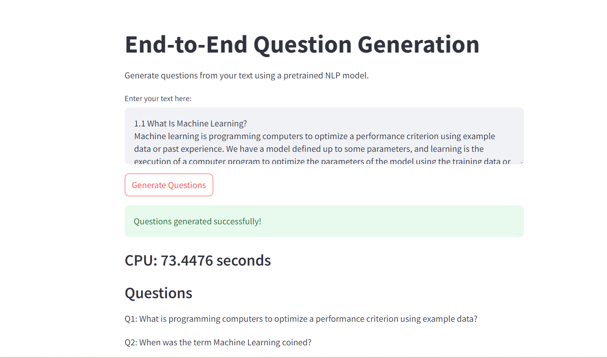

# Question Paper Generator

The **Question Paper Generator** is an innovative tool designed to automate the process of creating question papers from a given paragraph of text. Utilizing state-of-the-art pretrained models, the tool performs CPU inference to generate relevant and meaningful questions. This project aims to assist educators, content creators, and students by simplifying the task of question paper preparation.



## Features

- **Time-Saving**: Significantly reduces the time required to create question papers, allowing educators and content creators to focus more on teaching and content development.
- **Consistency and Quality**: Ensures consistent and high-quality questions by leveraging advanced NLP models.
- **Versatility**: Can be used across various subjects and content types, making it a versatile tool for different educational contexts.
- **Convenience**: Easy download options in PDF and Word formats provide a convenient way to distribute and customize question papers.

## Getting Started

### Prerequisites

Ensure you have the following installed:

- Python 3.x
- pip (Python package installer)
- Streamlite
- Torch
- Transformers
- ReportLab

### Installation

1. **Clone the repository:**

    ```bash
    git clone https://github.com/your-username/question-paper-generator.git
    cd question-paper-generator
    ```

2. **Install dependencies:**

    ```bash
    pip install -r requirements.txt
    ```

3. **Run the application:**

    ```bash
    streamlit run app.py
    ```

### Usage

1. **Launch the application:**

    ```bash
    streamlit run app.py
    ```

2. **Input the desired paragraph of text.**
3. **Click on the "Generate Questions" button.**
4. **Preview the generated questions.**
5. **Download the questions in PDF or Word format.**

## Example

Here's a quick example to get you started:

1. **Input Text:**

    ```
    Machine learning is programming computers to optimize a performance criterion using example
data or past experience. We have a model defined up to some parameters, and learning is the
execution of a computer program to optimize the parameters of the model using the training data or
past experience. The model may be predictive to make predictions in the future, or descriptive to gain
knowledge from data, or both.
Arthur Samuel, an early American leader in the field of computer gaming and artificial intelligence,
coined the term “Machine Learning” in 1959 while at IBM. He defined machine learning as “the field of
study that gives computers the ability to learn without being explicitly programmed.” However, there is
no universally accepted definition for machine learning. Different authors define the term differently.

    ```

2. **Generated Questions:**

    - **Questions**:Q1: What is programming computers to optimize a performance criterion using example data?
Q2: Who coined the term "Machine Learning" in 1959 while working at IBM?
Q3: What is learning the execution of a computer program to optimize the parameters of the model usQ4: Who coined the term "Machine Learning" in 1959 while at IBM?
Q5: What is the execution of a computer program to optimize the parameters of the model using the trQ6: What is the execution of a computer program to optimize the parameters of the model using the trQ7: When was the term Machine Learning coined?
Q8: Who was an early American leader in the field of computer gaming and artificial intelligence?
Q9: What is programming computers to optimize a performance criterion using example data or past eQ10: When did Arthur Samuel coin the term Machine Learning?

## Contributing

We welcome contributions! Please see our [CONTRIBUTING.md](CONTRIBUTING.md) for more details.

## License

This project is licensed under the MIT License - see the [LICENSE.md](LICENSE.md) file for details.

## Acknowledgments

- Thanks to the open-source community for the tools and models that make this project possible.

---

Feel free to customize this README template to better fit your project's specifics and needs. Add sections, images, badges, or any other content that you think will help users understand and appreciate your project more.